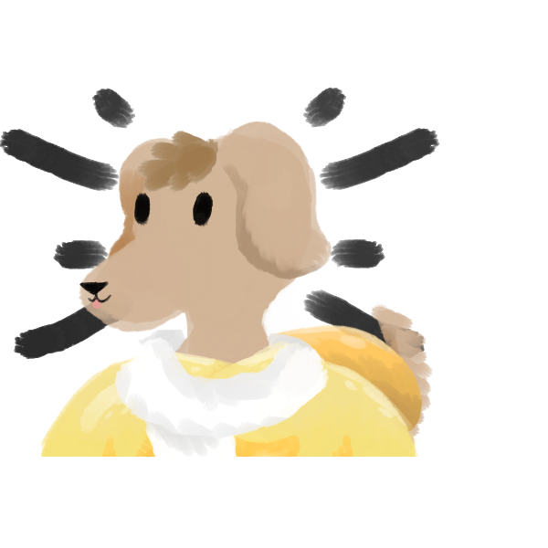

  <a href="https://github.com/chani0520">
  
<!--    -->

 
  

 
  
  
  
<!--    -->

<!-- ref : https://www.youtube.com/watch?v=TsaLQAetPLU&list=WL&index=20&t=1093s -->

    
 <strong> [work experience] </strong> 

  - 2019.08.01 ~ 2021.09.30 shinhan card billing system SM (subcontractor)
  
  - 2021.12.01 ~ 2021.09.31 make app with my colleague

  - 2022.10.01 ~            co-founder at Plead Co., Ltd.

