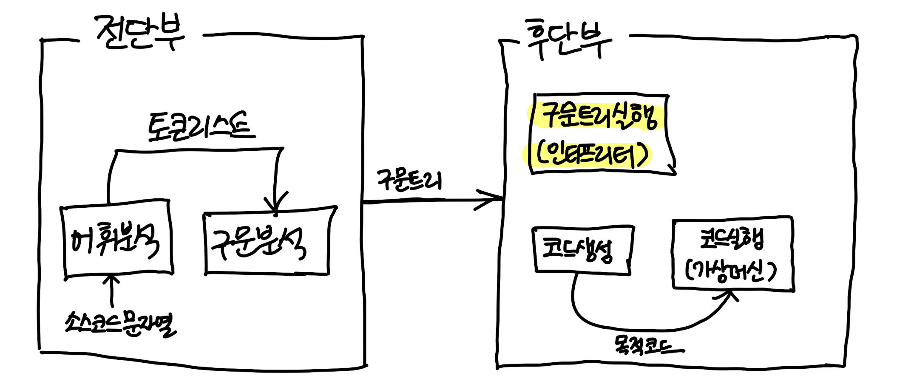

### 지금까지 배운 내용...

- 2장 '어휘 분석' => 소스코드의 문자열을 분석  return '**토큰 리스트**'

- 3장 '구문 분석' => 소스코드의 구조를 분석 return '**구문 트리**'
- **구문 트리는 전단부와 후단부를 잇는 매개체의 역할**



- 인터프리터는 구문 트리를 실행하는 프로그램으로 구문트리를 순회하며 노드를 실행한다.


### 4.1 구문 트리 순회

- 컴파일러가 구문 트리를 순회시에는 '비지터 패턴'이라는 디자인 패턴을 흔히 사용하지만 본 책에서는 가상 함수를 활용하여 구문트리를 순회한다.

```c++
// Node.h
// 부모 문 노드
struct Statement {
  virtual auto interpret() -> void = 0;
}

// 부모 문 노드를 상속받는 모든 문 노드
struct Function: Statement {
  auto interpret() -> void;
}

// 부모 식 노드
struct Expression {
  virtual auto interpret() -> any = 0;
}

// 부모 식 노드를 상속받는 모든 식 노드
struct Or: Expression {
  auto interpret() -> any;
}

```


### 4.2 구문 트리 실행기

- 구문 트리의 루트 노드부터 입력받아 순회

```c++
// Main.cpp
auto interpret(Program*) -> void;

auto main() -> void {
  string sourceCode = R""""(
    function main() {
      printLine 'Hello, World!';
      printLine 1 + 2 * 3;
    }
  )"""";

  auto tokenList = scan(sourceCode);
  auto syntaxTree = parse(tokenList);

  interpret(systaxTree);
}
```


#### 4.2.1 엔트리 포인트 함수 호출

- 프로그램 노드에 포함된 함수 노드들은 functionTable 변수에 등록되고, 엔트리포인트인 main함수를 만나면 interpret() 함수를 호출한다.

> Interpreter.cpp 참고


#### 4.2.2 함수

- 함수의 실행은 본문의 노드를 순회하는 것이 전부

> Interpreter.cpp 참고


#### 4.2.3 print문

- print문 노드가 가진 식 노드들을 순회하며 interpret()함수 호출

> Interpreter.cpp 참고


#### 4.2.4 데이터 타입

- 동적 타입언어 사용
- isXXX() 함수들은 any 타입에 들어있는 값의 타입이 무엇인지 확인
- toXXX() 함수들은 any 타입에 들어있는 값을 캐스팅

```c++
// Datatype.cpp
auto isString(any value)->bool {
  return value.type() == typeid(string);
}

auto toString(any value)->string {
  return any_cast<string>(value);
}
```


#### 4.2.5 문자열 리터럴

- 노드가 가진 문자열 값만 반환하면 됨

> Interpreter.cpp 참고


#### 4.2.6 산술 연산

- 멤버 : 왼쪽 식 노드, 오른쪽 식 노드

> Interpreter.cpp 참고


#### 4.2.7 논리 연산

- 단락 평가
  - or : 양쪽의 피연산자 식의 결과중 하나라도 참이라면 식 전체의 결과가 참 ( 왼쪽식부터 평가해서 결과 도출 가능 )
  - and : 왼쪽식의 결과가 거짓이면 거짓 반환, 참이라면 오른쪽 식의 결과 반환하면 됨

> Interpreter.cpp 참고


#### 4.2.8 변수의 선언과 참조

- 지역변수는 선언된 위치에 따라 유효범위가 달라짐
- 전역변수는 블럭에 상관없이 어디에서든 참조 가능

> Interpreter.cpp 참고


#### 4.2.9 for문

- 블럭과 제어변수를 가짐 ( 제어변수의 유효 범위는 블럭{}에 종속 )
- **조건식**은 본문을 실행하기 전마다 평가되므로 먼저 조건식 노드를 순회 -> 결과가 거짓이라면 무한루프를 탈출하고 아니면 본문의 문 노드를 순회
- **증감식**은 본문의 실행이 끝났을 때마다 평가되므로 본문의 실행이 끝나면 증감식 노드를 순회

> Interpreter.cpp 참고


#### 4.2.10 if문

- if문에는 if절과 elif절에 포함된 하나 이상의 조건식이 있으므로 조건식의 갯수만큼 루프를 도는것으로 시작

> interpreter.cpp 참고


#### 4.2.11 continue문

- continue문의 실행은 콜 스택을 역행하도록 예외처리

> interpreter.cpp 참고


#### 4.2.12 함수 호출

- 함수는 호출을 할수 있고, 호출하면서 인자를 넘길수 있고, 결과값을 반환할 수도 있고, 프로그래밍 언어가 제공하는 내장 함수도 있다.

- 함수를 호출하는 것은 식이고 함수의 이름으로 호출

> interpreter.cpp 참고


#### 4.2.13 함수 호출 인자

- 인자식 노드 리스트를 순회해 인자값들을 구하고, 매개 변수의 이름과 인자값을 매핑시켜 보관한다. 


#### 4.2.14 return문

- continue문과 처리방법은 동일, 

> interpreter.cpp 참고


#### 4.2.15 내장 함수

- 내장함수들을 관리할 전역변수를 선언해서 사용됨
- 사용자 정의 함수의 호출을 구현했던것과 동일하게 builtinFunctionTable 전역변수에 식별자의 이름으로 등록된 내장 함수가 있는지 확인하고, 있다면 등록된 내장함수를 반환한다.

```c++
map<string, function<any(vector<any>)>> builtinFunctionTable = {
  {"sqrt", [](vector<any> values)->any {
    return sqrt(toNumber(values[0]));
  }},
};
```

> interpreter.cpp 참고


#### 4.2.16 배열 리터럴

> interpreter.cpp & Datatype.cpp 참고


#### 4.2.17 원소값 참조

- 배열의 원소값 참조

- 원소값 참조를 표현하는 노드는 피연산자 식 노드와 인덱스 식 노드를 가진다.

  ( 피연산자 식 노드의 결과값은 배열이고, 인덱스 식 노드의 결과값은 인덱스로 사용할 정수 )

> interpreter.cpp & Datatype.cpp 참고


#### 4.2.18 원소값 변경

- 원소값 참조와 동일하게 피연산자 식 노드와 인덱스 식 노드를 가지지만, 대입 식 노드를 추가로 가진다. (대입 식 노드의 결과값은 배열의 해당 인덱스에 대입할 값)

> interpreter.cpp & Datatype.cpp 참고


### 4.3 마치며

- 구문트리를 순회하며 노드들을 실행하는 인터프리터를 만듦
- 다음장인 5장. 코드생성에서는 다시 구문 분석의 결과인 구문 트리로 돌아가 컴파일 재개


```c++
// Main.cpp
auto interpret(Program*) -> void;

auto main() -> void {
  string sourceCode = R""""(
    function main() {
      // p83
      print 'Hello, World!';

      // p84
      print 1 * 2 + 3 * 4;

      // p86
      printLine true or 'Hello, World!'; // => true
      printLine false or 'Hello, World!'; // => Hello, World!
      printLine true and 'Hello, World!'; // => Hello, World!
      printLine false and 'Hello, World!'; // => false

      // p89~90
      global = 4;
      val local = 13;
      global = local = 7;
      printLine 'global : ', global; // => global : 7
      printLine 'local : ', local; // => local : 7

      // p92
      for i=0, i<3, i=i+1 {
        printLine 'i: ', i; 
                              // i: 0
                              // i: 1
                              // i: 2
      }

      // p94
      for i=0, i<5, i=i+1 {
        if i==1 {
          printLine 'one';
        } elif i=2 {
          printLine 'two';
        } elif i=3 {
          printLine 'three';
        } else {
          printLine i;
        }
      }
      // 0
      // one
      // two
      // three
      //4

      // p96
      for i=0, i<3, i=i+1 {
        if i == 1 {
          continue;
        }
        printLine 'i: ', i;
      }
      // i: 0
      // i: 2

      // p98
      sayHoHoHo(); // Ho! Ho! Ho!

      // p100 
      add(1,3); // 4

      // p101
      print getC(3, 4); // 25 

      // p104
      print sqrt(getC(3, 4)); // 5 ( sqrt라는 내장함수 호출 )

      // p105
      print [1, 2, 3]; // [1 2 3]

      // p107
      print['first', 'second', 'third'][1]; // second

      // p108
      var array = ['first', 'second', 'third'];
      array[1] = '2nd';
      printLine array[1]; // 2nd
    }

    function sayHoHoHo() {
      print 'Ho! Ho! Ho!'; 
    }

    function add(a, b) {
      print a + b;
    }

    function getC(a, b) {
      return a * a + b * b;
    }
  )"""";

  auto tokenList = scan(sourceCode);
  auto syntaxTree = parse(tokenList);

  interpret(systaxTree);
}
```


```c++
// Datatype.cpp
auto isString(any value)->bool {
  return value.type() == typeid(string);
}

auto toString(any value)->string {
  return any_cast<string>(value);
}

auto operator<<(ostream& stream, any& value)->ostream& {
  if (isNull(value)) {
    stream << "null";
  }
  else if (isBoolean(value)) {
    stream << boolalpha << any_cast<bool>(value);
  }
  else if (isNumber(value)) {
    printf("%g", toNumber(value));
  }
  else if (isString(value)) {
    stream << toString(value);
  }

  // 배열의 경우, [1 2 3]과같이 출력되도록 작성됨
  else if (isArray(value)) {
    stream << "[ ";
    for (auto& value : toArray(value)->values)
      stream << value << " ";
    stream << "]";
  }
  else if (isMap(value)) {
    stream << "{ ";
    for (auto& [key, value] : toMap(value)->values)
      stream << key << ":" << value << " ";
    stream << "}";
  }
  return stream;
}

// any타입의 값의 데이터 타입이 함수의 호출을 표현하는 노드인지 확인
auto isFunction(any value)->bool {
  return value.type() == typeid(Function*);
}

auto toFunction(any value)->Function* {
  return any_cast<Function*>(value);
}

// 매개변수로 받은 any타입의 값의 데이터 타입이 내장함수인지 확인
auto isBuiltinFunction(any value)->bool {
  return value.type() == typeid(function<any(vector<any>)>);
}

auto toBuiltinFunction(any value)->function<any(vector<any>)> {
  return any_cast<function<any(vector<any>)>>(value);
}

// 매개변수로 받은 배열에서 매개변수로 받은 인덱스에 해당하는값을 반환
auto getValueOfArray(any object, any index)->any {
  auto i = static_cast<size_t>(toNumber(index));
  if (i >= 0 && i < toArray(object)->values.size())
    return toArray(object)->values[i];
  return nullptr;
}

// 대입연산자는 대입한 값을 결과값으로 남기므로 배열의 원소에 저장한 값을 반환
auto setValueOfArray(any object, any index, any value)->any {
  auto i = static_cast<size_t>(toNumber(index));
  if (i >= 0 && i < toArray(object)->values.size())
    toArray(object)->values[i] = value;
  return value;
}

```

```c++
// Interpreter.cpp
// 함수의 이름과 함수 노드를 키와 값으로 가짐
static map<string, Function*> functionTable;

// extern은 다른 cpp파일에 선언된 전역변수를 참조하겠다는 뜻이고
// 내장함수의 이름과 내장함수 식을 키와 값으로 가진다. 
extern map<string, function<any(vector<any>)>> builtinFunctionTable;

// 전역변수
static map<string, any> global;

// 지역변수
// 바깥쪽의 리스트 : 함수의 블럭
// 안쪽의 리스트 : for, if문 같은 문의 블럭 ( 맵에는 변수의 이름과 값을 저장 )
static list<list<map<string, any>>> local;

// 구문 트리의 루트노드이자 소스코드의 선언 영역을 표현하는 프로그램 노드를 인자로 받는 interpret()
auto interpret(Program* program) -> void {
  for ( auto& node: program -> functions ) 
    functionTable[node->name] = node; // 함수 노드들을 functionTable 변수에 등록

  if ( functionTable["main"] == nullptr )
    return;

  try {
    local.emplace_back().emplace_front();
    // 엔트리 포인트 함수 호출
    functionTable["main"]->interpret();
  } catch ( ReturnException e ) {
    local.pop_back();
  }
}

// 함수의 실행은 본문의 노드를 순회하는 것이 전부
auto Function::interpret()->void {
  for (auto& node: block)
    node->interpret();
}

// 변수의 선언
auto Variable::interpret()->void {
  local.back().front()[name] = expression->interpret();
}

// 변수의 참조 ( 변수의 이름을 키로 local 전역변수를 검색 )
auto GetVariable::interpret()->any {
  for (auto& variables: local.back()) {
    if (variables.count(name))
      return variables[name];
  }

  // 지역변수에서 찾지 못하면 전역변수로 간주해 global에서 검색
  if (global.count(name))
    return global[name];

  // 그렇지 못하면 사용자 정의 함수내에서 찾고 그렇지 못하면 내장 함수에서 검색한다.
  if (functionTable.count(name))
    return functionTable[name];
  if (builtinFunctionTable.count(name))
    return builtinFunctionTable[name];
  return nullptr;
}

// 변수값 수정 ( 변수의 이름을 키로 검색하고 기존의 저장된 값을 식의 반환값으로 바꿔줌 )
auto SetVariable::interpret()->any {
  for (auto& variables: local.back()) {
    if (variables.count(name))
      return variables[name] = value->interpret();
  }

  // local전역변수에서 선언을 찾지 못하면 global 전역변수에서 값을 바꾸거나 새로 등록
  return global[name] = value->interpret();
}

auto GetElement::interpret()->any {
  auto object = sub->interpret();
  auto index_ = index->interpret();
  if (isArray(object) && isNumber(index_))
    return getValueOfArray(object, index_);
  if (isMap(object) && isString(index_))
    return getValueOfMap(object, index_);
  return nullptr;
}

auto SetElement::interpret()->any {
  auto object = sub->interpret();
  auto index_ = index->interpret();
  auto value_ = value->interpret();
  if (isArray(object) && isNumber(index_))
    return setValueOfArray(object, index_, value_);
  if (isMap(object) && isString(index_))
    return setValueOfMap(object, index_, value_);
  return nullptr;
}

// 논리연산, 양쪽의 피연산자 식의 결과중 하나라도 참이라면 식 전체의 결과가 참 ( 왼쪽식부터 평가해서 결과 도출 가능 )
auto Or::interpret()->any {
  return isTrue(lhs->interpret()) ? true : rhs->interpret();
}

// 논리연산, 왼쪽식의 결과가 거짓이면 거짓 반환, 참이라면 오른쪽 식의 결과 반환하면 됨
auto And::interpret()->any {
  return isFalse(lhs->interpret()) ? false : rhs->interpret();
}

// print문 노드가 가진 식 노드들을 순회하며 interpret()함수 호출
auto Print::interpret()->void {
  for (auto& node: arguments) {
    auto value = node->interpret();
    cout << value;
  }
  if (lineFeed) cout << endl;
}

// 노드가 가진 문자열 값만 반환하면 됨
auto StringLiteral::interpret()->any {
  return value;
}

// 산술연산 ( 양쪽 식 노드 순회하며 두 피연산자의 값 구함 => 연산의 결과값을 반환 )
auto Arithmetic::interpret()->any {
  auto lValue = lhs->interpret();
  auto rValue = rhs->interpret();
  if (kind == Kind::Add && isNumber(lValue) && isNumber(rValue)) {
    return toNumber(lValue) + toNumber(rValue);
  }
  if (kind == Kind::Add && isString(lValue) && isString(rValue)) {
    return toString(lValue) + toString(rValue);
  }
  if (kind == Kind::Subtract && isNumber(lValue) && isNumber(rValue)) {
    return toNumber(lValue) - toNumber(rValue);
  }
  if (kind == Kind::Multiply && isNumber(lValue) && isNumber(rValue)) {
    return toNumber(lValue) * toNumber(rValue);
  }
  if (kind == Kind::Divide && isNumber(lValue) && isNumber(rValue)) {
    return toNumber(rValue) == 0 ? 0.0 : toNumber(lValue) / toNumber(rValue);
  }
  if (kind == Kind::Modulo && isNumber(lValue) && isNumber(rValue)) {
    return toNumber(rValue) == 0 ? toNumber(lValue) : fmod(toNumber(lValue), toNumber(rValue));
  }
  return 0.0;
}

// for문
auto For::interpret()->void {
  // 블럭을 먼저 생성한 후, 제어변수를 등록해야 함
  local.back().emplace_front();
  variable->interpret();
  while (true) {
    // 무한루프 안에서 조건식이 거짓이 아닐때까지 반복한다.
    auto result = condition->interpret();
    if (isTrue(result) == false)
      break;
    try {
      for (auto& node: block)
        node->interpret();
    } catch (ContinueException) {
      /* empty */
    } catch (BreakException) {
      break;
    }
    expression->interpret();
  }
  local.back().pop_front(); // 본문을 반복해서 실행하다가 본문의 실행이 끝나면 앞서 생성했던 문 블럭을 제거
}

// if문
auto If::interpret()->void {
  // conditions.size() = 조건식의 갯수만큼 반복
  for (size_t i = 0; i < conditions.size(); i++) {
    // 조건식을 판단해 해당 결과가 거짓이면 continue;
    auto result = conditions[i]->interpret();
    if (isTrue(result) == false)
      continue;

    // 조건식이 true라면, if문 또는 elif문은 각각 문 블럭을 가지므로 본문을 실행하기 전에 문 블럭을 먼저 생성
    local.back().emplace_front();
    for (auto& node: blocks[i])
      node->interpret();

    // 본문 수행이 완료된 후에는 생성했던 문 블럭 제거
    local.back().pop_front();
    return;
  }

  // 선 모든 조건식의 결과가 거짓일때 else절이 없다면 if문의 실행을 종료
  if (elseBlock.empty())
    return;

  // else절 또한 문 블럭을 가지기 때문에, 순회하기 전에 문 블럭을 생성하고 끝나면 제거한다.
  local.back().emplace_front();
  for (auto& node: elseBlock)
    node->interpret();
  local.back().pop_front();
}

struct ContinueException {};
auto Continue::interpret() -> void {
  throw COntinueException();
}

struct BreakException {};
auto Break::interpret()->void {
  throw BreakException();
}

// 함수의 호출을 표현하는 노드
auto Call::interpret()->any {
  auto value = sub->interpret();
  // 피연산자식 노드의 결과가 내장함수인지 확인
  if (isBuiltinFunction(value)) {
    vector<any> values;
    // 인자식 노드들을 순회해서 인자값들을 리스트에 담고, 인자값 리스트와 함께 내장 함수를 호출한 후 반환된 값을 그대로 반환
    for (size_t i = 0; i < arguments.size(); i++)
      values.push_back(arguments[i]->interpret());
    return toBuiltinFunction(value)(values);
  }

  // 피연사자 식 노드의 반환값이 함수 노드가 아니라면 null을 반환
  if (isFunction(value) == false)
    return nullptr;
  map<string, any> parameters;

  // 인자식 노드 리스트를 순회해 인자값들을 구하고, 매개 변수의 이름과 인자값을 매핑시켜 보관한다. 
  for (size_t i = 0; i < arguments.size(); i++) {
    auto name = toFunction(value)->parameters[i];
    parameters[name] = arguments[i]->interpret();
  }

  // 함수 블럭 생성
  local.emplace_back().push_front(parameters);
  try {
    // 함수 블럭에 인자값들을 넣어놓고 함수를 호출
    toFunction(value)->interpret();
  } catch (ReturnException exception) {
    local.pop_back();
    return exception.result;
  }
  local.pop_back();
  return nullptr;
}

struct ReturnException { 
  any result; 
};
auto Return::interpret() -> void {
  // 반환값 식 노드를 순회한 결과값을 인자로 예외 객체 생성
  throw ReturnException{expression->interpret()};
}

// 배열리터럴
auto ArrayLiteral::interpret()->any {
  auto result = new Array();
  for (auto& node: values)
    result->values.push_back(node->interpret());
  return result;
}

auto MapLiteral::interpret()->any {
  auto result = new Map();
  for (auto& [key, value]: values)
    result->values.insert_or_assign(key, value->interpret());
  return result;
}
```

