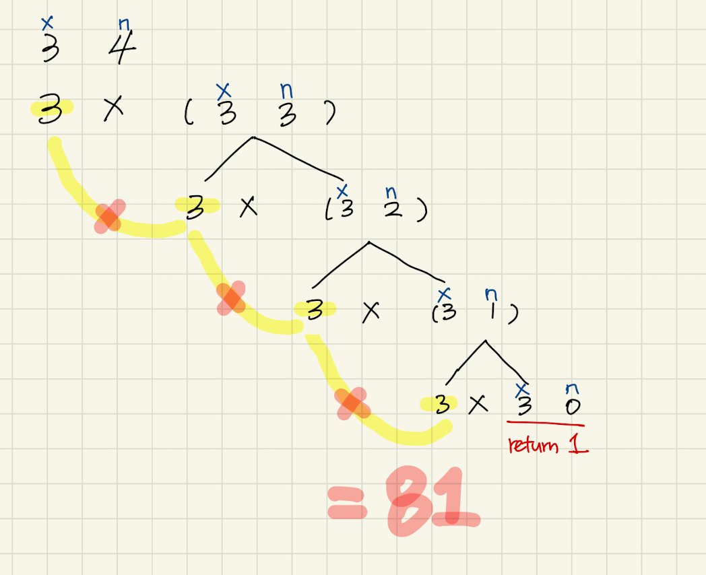

# power 함수

- base가 되는 숫자의 n제곱을 구함 ( base의 n승이라고도 표현하고, 기호로는 base^n으로도 표현 )

```
ex) 10의 2제곱을 구한다고 했을 때
-> pow(10, 2);
```

> 참고 : [[C언어/C++] pow, sqrt함수에 대해서(루트함수, 제곱, 제곱근)](https://blockdmask.tistory.com/307)

## 1. **for**문을 사용한 구현

```javascript
/*
시간복잡도 : O(n) linear time
  result = 1 이 한번, i = 0 이 한번, i++이 n번, result *= x가 n번이 합쳐져서 총 2n+1
  이를 Big-O(점근적 상한) 표기법으로 표현하면 2n+1 = O(n)
공간복잡도 : O(1) constant time
  함수가 받는 인자 x, n,
  그리고 결과값을 저장하기 위해 사용한 result,
  그리고 for문 내부에서 index로 사용하는 i
  스택에는 위에서 언급한 값들만 저장되기 때문에 O(1)
*/

function powerIterative(x, n) {
  let result = 1;

  // console.log("x : ", x);
  for (let i = 1; i < n + 1; i++) {
    result *= x;
    // console.log("i : ", i, ", result : ", result);
  }

  return result;
}

console.log(powerIterative(3, 4)); // 81

/*
x :  3
i :  1 , result :  3
i :  2 , result :  9
i :  3 , result :  27
i :  4 , result :  81
81
*/
```


## 2. **Recursive**를 사용한 구현

### 2-1 일반 적인 재귀

- x, n 두 인자는 받아야함
- 재귀로 만든 함수를 다시 호출할수 있도록

```javascript
/*
시간복잡도 : O(n)
공간복잡도 : O(n) linear time
  함수가 받는 인자 x, n,
  그리고 함수가 재귀 호출 되기 때문에, 스택에서는 n부터 n이 0이되어 1이 return될때까지 스택에 쌓이게 될것이기 때문에 
  공간복잡도는 O(n)
*/

function powerRecursive01(x, n) {
  if (n === 0) return 1; // 종결조건
  // console.log("x : ", x, ", n : ", n);

  return x * powerRecursive01(x, n - 1);
}
console.log(powerRecursive01(3, 4)); // 81

/*
x :  3 , n :  4
x :  3 , n :  3
x :  3 , n :  2
x :  3 , n :  1
81
*/
```




### 2-2 n제곱이 홀수or짝수인 경우를 구분해서 계산하기

- 홀수일때, 짝수일때를 구분해서 계산할 수도 있다.

- 아래처럼 했을때의 장점... 위의 경우 n번만큼 계속 반복해야 하지만, 아래와 같이 처리했을 경우
  예로 2의 4승의 경우, 3회의 연산으로 값을 구할 수 있다.

  > 2^4
  > 
  > 2^2 * 2^2
  > 
  > 2^1 * 2^1 * 2^1 * 2^1 = 2 * 2 * 2 * 2 = 16

```javascript
function powerRecursive(x, n) {
  if (n === 0) return 1;
  else if (n % 2 === 0) return powerRecursive(x, parseInt(n / 2)) ** 2;
  return x * powerRecursive(x, n - 1);
}

console.log(powerRecursive(3, 4));
```
