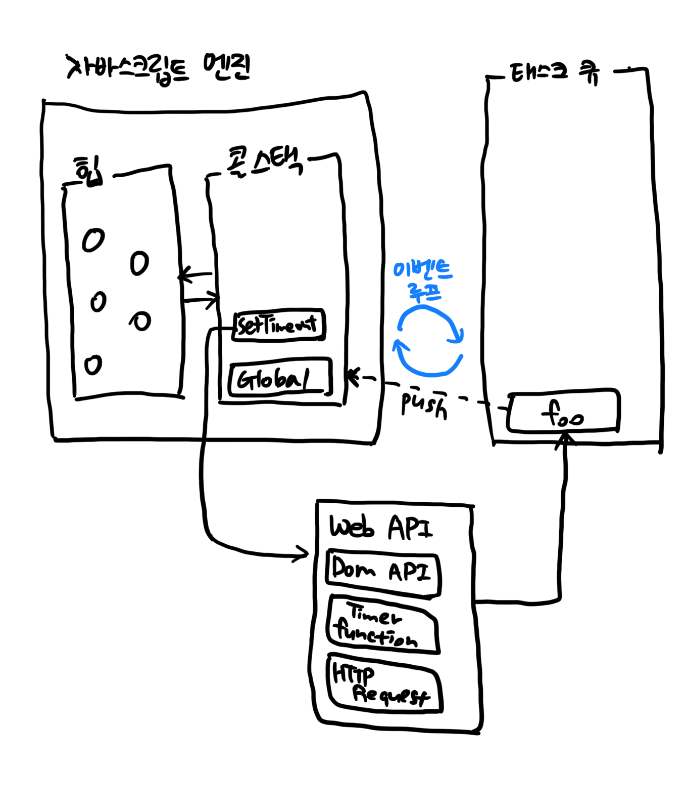

## 42.1 동기 처리와 비동기 처리

- 함수를 호출하면 함수코드가 평가되어 함수 실행 컨텍스트가 생성됨

- 이때 생성된 함수 실행 컨텍스트는 실행 컨텍스트 스택 ( 또는 콜 스택 )에 push되고 함수 코드가 실행된다. 함수 코드의 실행이 종료되면 함수 실행 컨텍스트는 실행 컨텍스트 스택에서 pop되어 제거됨

```javascript
const foo = () => {};
const bar = () => {};

foo();
bar();

// [               ]    [               ]    [                   ]    [                   ]     [                   ]    [                   ]    [                   ]
// [               ]    [               ]    [                   ]    [                   ]     [                   ]    [                   ]    [                   ]
// [               ] => [               ] => [                   ] => [                   ]  => [                   ] => [                   ] => [                   ]
// [               ]    [               ]    [ foo 함수 실행 컨텍스트 ]    [                   ]     [ bar 함수 실행 컨텍스트 ]   [                   ]    [                   ]
// [               ]    [ 전역실행 컨텍스트  ]    [ 전역실행 컨텍스트      ]    [ 전역실행 컨텍스트      ]    [ 전역실행 컨텍스트      ]   [ 전역실행 컨텍스트      ]    [                   ]
```

- 함수가 실행되려면 "함수 코드 평가 과정"에서 생성된 함수 실행 컨텍스트가 실행 컨텍스트 스택에 푸쉬 되어야 함 ( 다시 말해, 실행 컨텍스트 스택에 함수 실행 컨텍스트가 푸쉬되는 것은 바로 함수 실행의 시작을 의미 )

- 함수가 호출된 순서대로 순차적으로 실행되는 이유는 함수가 호출된 순서대로 함수 실행 컨텍스트가 실행 컨텍스트에 푸쉬되기 때문

- 자바스크립트 엔진은 단 하나의 실행 컨텍스트 스택을 갖는다.

- 실행 컨텍스트 스택의 최상위 요소인 "실행 중인 실행 컨텍스트"를 제외한 모든 실행 컨텍스트는 모두 실행 대기 중인 태스크이다.

- 현재 실행 중인 태스크가 종료할 때까지 다음에 실행될 태스크가 대기하는 방식을 *동기synchronous 처리*라고 함

- 현재 실행중인 태스크가 종료되지 않은 상태라 해도 다음 태스크를 곧바로 실행하는 방식을 *비동기asynchronous 처리*라고 함

|      | 동기 처리                                            | 비동기 처리                        |
| ---- | ---------------------------------------------------- | ---------------------------------- |
| 장점 | 실행순서가 보장                                      | 블로킹이 발생되지 않음             |
| 단점 | 앞선 태스크들이 종료할 때까지 이후 태스크들이 블로킹 | 태스크의 실행 순서가 보장되지 않음 |

## 42.2 이벤트 루프와 태스크 큐

- 자바스크립트가 싱글 스레드(한 번에 하나의 태스크만 처리)로 동작하지만, 동시성(concurrency)를 지원해 주는 것이 바로 이벤트 루프

- 이벤트 루프는 브라우저에 내장되어 있는 기능 중 하나



> _콜 스택(call stack)_ : 소스코드 평가 과정에서 생성된 실행 컨텍스트가 추가되고 제거되는 스택 자료구조인 실행 컨텍스트 스택이 바로 콜 스택, 함수를 호출하면 함수 실행 컨텍스트가 순차적으로 콜 스택에 푸쉬되어 순차적으로 실행됨. JS 엔진은 단 하나의 콜스택을 사용하기 때문에 최상위 실행 컨텍스트(실행중인 실행 컨텍스트)가 종료되어 콜 스택에서 제거되기 전까지는 다른 어떤 태스크도 실행되지 않는다.
>
> _힙(heap)_ : 객체가 저장되는 메모리 공간. 콜 스택의 요소인 실행 컨텍스트는 힘에 저장된 객체를 참조한다.
>
> _태스크 큐(task queue/event queue/callback queue)_ : setTimeout이나 setInterval과 같은 비동기 함수의 콜백 함수 또는 이벤트 핸들러가 일시적으로 보관되는 영역.
>
> _이벤트 루프(event loop)_ : 콜 스택에 현재 실행 중인 실행 컨텍스트가 있는지, 그리고 태스크 큐에 대기 중인 함수(콜백 함수, 이벤트 핸들러 등)가 있는지 반복해서 확인. 만약 콜 스택이 비어 있고 태스크 큐에 대기 중인 함수가 있다면 이벤트 루프는 순차적(FIFO)으로 태스크 큐에 대기 중인 함수를 콜 스택으로 이동시킨다.
