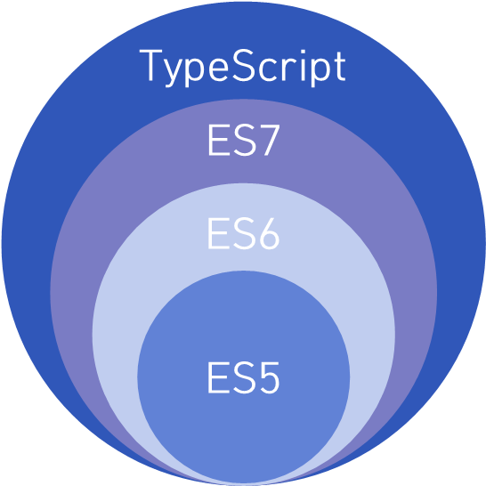

참고 : [TypeScript for JavaScript Programmers](https://www.typescriptlang.org/docs/handbook/typescript-in-5-minutes.html)

- TypeScript는 JavaScript위의 레이어로서 자리잡고 있는데, JavaScript의 기능들을 제공하면서 그 위에 자체 레이어를 추가.

- JavaScript에는 `string`, `number`, `object`, `undefined` 같은 원시 타입을 가지고 있지만, 전체 코드 베이스에 일관되게 할당되었는지는 확인해 주지 않는다. TypeScript는 이 레이어로서 동작!



- TypeScript의 타입 검사기는 사용자가 생각한 결과와 JavaScript의 실제 결과 사이의 불일치를 강조

## 타입 추론 ( Types by Inference )

- TypeScript는 타입을 가지는 타입 시스템을 구축 ( 이는 코드에서 타입을 명시하기 위해 추가로 문자를 사용할 필요가 없는 타입 시스템을 제공 )

```typescript
let helloWorld = 'Hello World';
//  ^?

// ==> TypeScript는 JavaScript의 동작 방식을 이해함으로서, 위와 같이 변수를 생성하면서 동시에 특정 값("Hello World"같은 string)을 할당하는 경우, TypeScript는 이를 해당 변수의 타입으로 사용한다. 이것이 TypeScript가 helloWorld라는 변수가 string임을 알게 되는 방식
```

## 타입 정의 ( Defining Types )

- JavaScript는 다양한 디자인 패턴을 가능하게 하는 동적 언어

- 동적 프로그래밍을 사용하고 있는 몇몇 디자인 패턴에는 자동으로 타입을 제공하기 힘들 수 있지만, 이러한 경우 TypeScript는 타입이 무엇이 되어야 하는지 명시 가능한 JavaScript 언어의 확장을 지원

```typescript
// name: string과 id: number를 포함하는 추론 타입을 가진 객체를 생성하는 예제
const user = {
  name: 'Chan',
  id: 0,
};

// 이 객체의 형태를 명시적으로 나타내기 위해서는 interface로 선언
interface User {
  name: string;
  id: number;
}

// 이제 변수 선언 뒤에 : Typename의 구문을 사용해 JavaScript 객체가 새로운 interface의 형태를 따르고 있음을 선언
const user: User = {
  name: 'Chan',
  id: 0,
};

// 해당 인터페이스에 맞지 않는 객체를 생성하면 TypeScript는 경고를 준다.
const user: User = {
  username: 'Bori',
  id: 0,
};
```

```typescript
// JavaScript는 클래스와 객체 지향 프로그램을 지원하기 때문에, TypeScript또한 동일하고, 인터페이스는 클래스로도 선언이 가능
interface User {
  name: string;
  id: number;
}

class UserAccount {
  name: string;
  id: number;

  constructor(name: string, id: number) {
    this.name = name;
    this.id = id;
  }
}

const user: User = new UserAccount('Chan', 1);
```

```typescript
// 인터페이스는 함수에서 매개변수와 리턴 값을 명시하는데도 사용
interface User {
  name: string;
  id: number;
}

function getAdminUser(): User {
  // ...
}

function deleteUser(user: User) {
  // ...
}
```

- JavaScript에서 사용할 수 있는 적은 종류의 원시 타입이 있다. `boolean`, `bigint`, `null`, `number`, `string`, `symbol`, `object`, `undefined`는 인터페이스에서도 사용 가능하고, TypeScript는 몇 가지를 추가해 목록을 확장한다. 예를들어, `any`(무엇이든 허용), `unknown`(이 타입을 사용하는 사람이 타입이 무엇을 선언했는가를 확인), `never`(이 타입은 발생될 수 없음), `void`(`undefined`를 리턴하거나 리턴 값이 없는 함수).

- 타입을 구축하기 위해 `interface`를 우선적으로 사용하고, 특정 기능이 필요할 때 `type`을 사용해야 한다.

## 타입 구성 ( Composing Types )

- 객체들을 조합하고 더 크고 복잡한 객체를 만드는 방법과 유사하게 TypeScript에 타입으로 이를 수행하는 도구가 있음. 여러가지 타입을 이용하여 새 타입을 작성하기 위해 코드에서 많이 사용되는 두 가지 코드로는 `유니언(Union)`과 `제네릭(Generic)`이 있다.

### 유니언 ( Union )

- 유니언은 타입이 여러 타입 중 하나일 수 있음을 선언하는 방법

```typescript
type MyBool = true | false;

type WindowStates = 'open' | 'closed' | 'minimized';
type LockStates = 'locked' | 'unlocked';
type OddNumbersUnderTen = 1 | 3 | 5 | 7 | 9;
```

- 유니언은 다양한 타입을 처리하는 방식을 제공하는데, 예를 들어 `array` or `string`을 받는 함수가 있을 수 있다.

```typescript
// getLength()라는 함수는 명시했듯이 obj라는 하나의 매개변수를 받는데, 유니언을 사용하면
// obj가 string 또는 string array를 함수임을 명시할 수 있다. ( 2022-03-15 added )
function getLength(obj: string | string[]) {
  return obj.length;
}
```

- TypeScript는 코드가 시간에 따라 변수가 변경되는 방식을 이해하며, 이러한 검사(typeof)를 이용해 타입을 골라낼 수 있다.

| Type      | Predicate                          |
| --------- | ---------------------------------- |
| string    | `typeof s === "string"`            |
| number    | `typeof n === "number"`            |
| boolean   | `typeof b === "boolean"`           |
| undefined | `typeof undefined === "undefined"` |
| function  | `typeof f === "function"`          |
| array     | `Array.isArray(a)`                 |

```typescript
// 예를 들어, typeof obj === "string"을 이용하여 string과 array를 구분할 수 있으며, TypeScript는 객체가 다른 코드 경로에 있음을 알게 됩니다.
// 영문을 뭔가 자연스런 한국어가 아닌듯한 말투로 번역이 되어있는 듯해서,, 다시 읽어봤는데 위의 '코드가 시간에 따라 변수가 변경되는 방식...' 뭔가 조사들이 이상하다.
// 이말은 함수가 호출되는 시점에 따라 obj라는 매개변수에 들어오는 데이터의 타입이 바뀔수 있기 때문에
// 유니언으로는 다양한 타입의 처리방식을 제공하고, 함수 내부에서 해당 매개변수의 타입을 검사(typeof)해
// 골라 낼수 있다는 말인것 같다. ( 2022-03-15 added )
function wrapInArray(obj: string | string[]) {
  // 매개변수로 들어온 데이터의 타입이 string인 경우, 해당 데이터가 존재하는 배열을 return하고,
  // 아닐 경우(string[]) 해당 매개변수로 들어온 데이터를 그대로 return
  if (typeof obj === 'string') {
    return [obj];
    //      ^?
  } else {
    return obj;
  }
}
```

### 제네릭 ( Generics )

- 제네릭은 타입에 변수를 제공하는 방법

- 배열이 일반적인 예시이며, 제네릭이 없는 배열은 어떤 것이든 포함할 수 있다. ( 제네릭이 있는 배열은 배열 안의 값을 설명할 수 있다. )

```typescript
type StringArray = Array<string>;
type NumberArray = Array<number>;
type ObjectWithNameArray = Array<{ name: string }>;
```

```typescript
// 제네릭을 사용하는 고유 타입을 선언할 수 있다.

// @errors: 2345
interface Backpack<Type> {
  add: (obj: Type) => void;
  get: () => Type;
}

// 이 줄은 TypeScript에 `backpack`이라는 상수가 있을 알리는 지름길이며
// const backpack: Backpack<string>이 어디서 왔는지 걱정할 필요가 없습니다.
// declare문을 통해서 const backpack을 선언하고 본 상수의 타입은 위에서 interface로 선언한
// Backpack을 따른다. 또한 제네릭으로 <string>이 선언되었기 때문에, interface내부에 선언된
// 두 함수의 Type에는 모두 string이 대입된다. ( 2022-03-15 added )
declare const backpack: Backpack<string>;

// 위에서 Backpack의 변수 부분으로 선언해서, object는 string입니다.
const object = backpack.get();

// backpack 변수가 string이므로, add 함수에 number를 전달할 수 없습니다.
backpack.add(23);
```

## 구조적 타입 시스템 ( Structural Type System )

- TypeScript의 핵심 원칙 중 하나는 타입 검사가 값이 있는 *형태*에 집중한다는 것. 이는 때때로 "덕 타이핑(duck typing)" 또는 "구조적 타이핑"이라고 불립니다.

> 덕 타이핑 : 컴퓨터 프로그래밍 분야에서 덕 타이핑은 동적 타이핑의 한 종류로, 객체의 변수 및 메소드의 집합이 객체의 타입을 결정하는 것을 말한다.

- *구조적 타입 시스템*에서 두 객체가 같은 형태를 가지면 같은 것으로 간주

```typescript
interface Point {
  x: number;
  y: number;
}

function printPoint(p: Point) {
  console.log(`${p.x}, ${p.y}`);
}

// "12, 26"을 출력합니다.
const point = { x: 12, y: 26 };
printPoint(point);

// ==> point변수는 Point타입으로 선언된 적이 없지만, TypeScript는 타입 검사에서 point의 형태와 Point의 형태를 비교한다. 둘 다 같은 형태이기 때문에 통과!
```

- 형태 일치에는 일치시킬 객체의 필드의 하위 집합만 필요

```typescript
// @errors: 2345
interface Point {
  x: number;
  y: number;
}

function printPoint(p: Point) {
  console.log(`${p.x}, ${p.y}`);
}

// --- cut ---
const point3 = { x: 12, y: 26, z: 89 };
printPoint(point3); // prints "12, 26"

const rect = { x: 33, y: 3, width: 30, height: 80 };
printPoint(rect); // prints "33, 3"

const color = { hex: '#187ABF' };
printPoint(color);
```

- 구조적으로 클래스와 객체가 형태를 따르는 방법에는 차이가 없다.

```typescript
// @errors: 2345
interface Point {
  x: number;
  y: number;
}

function printPoint(p: Point) {
  console.log(`${p.x}, ${p.y}`);
}

// -- cut --
class VirtualPoint {
  x: number;
  y: number;

  constructor(x: number, y: number) {
    this.x = x;
    this.y = y;
  }
}

const newVPoint = new VirtualPoint(13, 56);
printPoint(newVPoint); // prints "13, 56"

// ==> 객체 또는 클래스에 필요한 모든 속성이 존재한다면, TypeScript는 구현 세부 정보에 관계없이 일치하게 봅니다.
```
